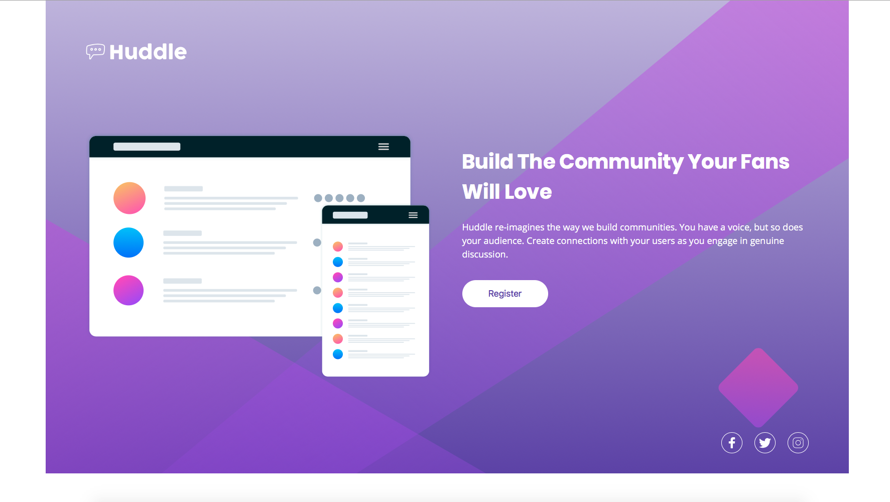

# Huddle landing page with single introductory section

It is a landing page from Frontendmentor challenge.

## Motivation

I want practice my knowledge in web development.

## Screenshot

  

## Tech/framework used

<b>Built with</b>

- HTML
- CSS

In this project I take some time to have a deep understanding of de project. the results of this I got a clean code. 

I use illustrator for know all real size of elements.

I use BEM to named CSS class and use a relative values as rem a em. 

## Credits  

[Frontend Mentor](https://www.frontendmentor.io) challenges allow you to improve your skills in a real-life workflow. 